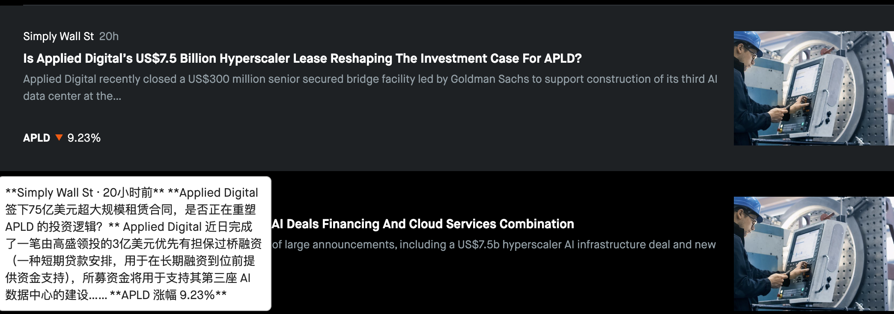

# Robinhood Translator

A Chrome extension + AWS-hosted backend that adds Chinese translation to Robinhood for non-English-speaking retail traders. Built primarily for my father — a retail investor who reads no English — to help him understand the news, summaries, and prose-heavy content on his trading dashboard.

> Select text or hover for 2 seconds. A floating tooltip shows the Chinese translation in place, with financial-term glosses and preserved ticker symbols.

## The problem

Robinhood is a US-only product with no Chinese localization. Browser-level translation tools (Google Translate) handle parts of the page but break on dynamic React-rendered content and hyperlinked news cards using stretched-link patterns. For someone who already navigates Robinhood by spatial memory, what's missing isn't the UI — it's the *content*: news summaries about held stocks, analyst commentary, earnings details, financial jargon in everyday prose.

This extension solves that.

## Highlights

- **LLM-based context-aware translation** — Anthropic Sonnet 4.6 with a domain-specific system prompt that preserves ticker symbols, numbers, dates, and adds parenthetical Chinese glosses for retail-trading terminology.
- **AWS serverless backend** — Python FastAPI on Lambda behind an HTTP API Gateway, deployed via AWS SAM. Entire cloud setup defined in `template.yaml`, reproducible with one `sam deploy`.
- **Two interaction modes** — hover-to-translate (2-second debounce) as primary, select-to-translate as power-user fallback. Both tooltips can coexist; neither stomps on the other.
- **News card handling** — detects Robinhood's "stretched link" overlay pattern (empty `<a>` on top of sibling content) and walks the DOM upward to extract title + summary.
- **Viewport-aware tooltip positioning** — flips above the anchor when there's no room below; clamps left/right to avoid horizontal overflow; scrollable interior for long translations.
- **Built iteratively with documented retros** — every iteration produces a `iteration_N_plan.md` and `iteration_N_retro.md` in `docs/`.

## Architecture

```
   ┌──────────────────┐      ┌──────────────────┐      ┌──────────────────┐
   │ Chrome extension │      │   AWS Cloud      │      │  Anthropic API   │
   │   on robinhood   │      │                  │      │                  │
   │       .com       │─────▶│  API Gateway     │─────▶│   Sonnet 4.6     │
   │                  │ POST │   (HTTP API)     │      │                  │
   │  content.js      │      │       │          │      │                  │
   │  manifest.json   │◀─────│       ▼          │◀─────│                  │
   │                  │      │     Lambda       │      │                  │
   │  • mouseover     │      │  (FastAPI +      │      │                  │
   │  • mouseup       │      │   Mangum)        │      │                  │
   │  • tooltips      │      │       │          │      │                  │
   └──────────────────┘      │       ▼          │      └──────────────────┘
                             │   DynamoDB       │
                             │   (cache, soon)  │
                             └──────────────────┘
```

Three components:

- **Chrome extension** (`extension/`) — Manifest V3 content script captures hover and selection events on `robinhood.com`, sends text to the backend, displays the response in a floating tooltip.
- **Backend** (`backend/`) — Python FastAPI on AWS Lambda, called via API Gateway. Adds a financial-context system prompt and forwards to Anthropic.
- **Infrastructure as code** (`backend/template.yaml`) — AWS SAM template defining Lambda, API Gateway, IAM role, CORS, DynamoDB. Every infrastructure change goes through git.

## Tech stack

| Layer | Tools |
|-------|-------|
| Frontend | Chrome Extension Manifest V3, vanilla JavaScript, HTML, CSS |
| Backend | Python 3.13, FastAPI, Mangum, Anthropic SDK, python-dotenv |
| Cloud | AWS Lambda, API Gateway (HTTP API), DynamoDB, CloudWatch, CloudFormation/SAM |
| Tooling | Git, GitHub, AWS CLI, AWS SAM CLI, Claude Code, VS Code |

## Key engineering decisions

A few choices worth surfacing for anyone reading the code:

**LLM-based translation, not a translation API.** Google Translate / DeepL would be cheaper per call, but an LLM lets the system prompt encode domain rules — preserve tickers, gloss "earnings beat" with a Chinese parenthetical, keep numbers and dates unchanged. Quality on financial prose is significantly better.

**Secrets never ship to the client.** The Anthropic API key lives only as a Lambda environment variable, passed as a SAM template parameter at deploy time. The extension only knows the API Gateway URL.

**Two independent tooltip elements, not one shared.** Selection and hover each own a DOM element with its own generation counter. A slow hover response can't overwrite a newer selection translation, and a new selection can't kill a hover tooltip the user is reading.

**News card detection via stretched-link pattern.** Robinhood places empty `<a>` overlays on top of sibling content (title + summary). The `resolveTextBlock()` function detects this case and walks upward to find the card container, extracting both title and summary in one go.

**English-word filter on the client.** Hover only fires when the extracted text contains at least one 3+ letter English word — prevents spurious API calls on UI chrome like `$0.00 ▼ 9.23%`.

**Infrastructure as code from day one.** Every cloud resource is in `template.yaml`. No manual console configuration. `sam deploy` reconciles AWS with what's in git.

## Project structure

```
robinhood-translator/
├── README.md
├── .gitignore
├── extension/                  Chrome extension
│   ├── manifest.json           Manifest V3 config
│   └── content.js              Selection + hover logic, tooltip rendering
├── backend/                    AWS Lambda backend
│   ├── main.py                 FastAPI app + Mangum handler
│   ├── requirements.txt        Python deps (pinned)
│   ├── template.yaml           AWS SAM IaC template
│   └── .env                    Local development (gitignored)
└── docs/                       Project documentation
    ├── budget.md               Cost estimates + billing alerts
    ├── eval_set.md             Translation examples and user feedback
    ├── iteration_2_plan.md     Retros + plans, one per iteration
    └── iteration_3_plan.md
```

## Setup

### Prerequisites

- An AWS account with the AWS CLI configured
- AWS SAM CLI installed
- An Anthropic API key
- Python 3.13, Node.js (for the extension toolchain, optional)
- Chrome (for installing the extension)

### Deploy the backend

```bash
cd backend
python3 -m venv .venv
source .venv/bin/activate
pip install -r requirements.txt

sam build
sam deploy --guided    # first time only — saves config to samconfig.toml
                       # subsequent deploys: just `sam deploy`
```

The guided deploy prompts for the Anthropic API key (passed as a CloudFormation parameter, never written to git). Save the API Gateway URL it outputs — you'll need it for the extension.

### Install the extension

1. Open `extension/content.js`. Replace the value of `TRANSLATE_URL` with your API Gateway URL.
2. Open Chrome → `chrome://extensions`.
3. Enable Developer mode (top right).
4. Click Load unpacked → select the `extension/` folder.
5. Visit any Robinhood page. Hover over English text for 2 seconds, or select text manually.

## Roadmap

This is an active personal project. Iteration progress is recorded in `docs/iteration_*_plan.md` and `docs/iteration_*_retro.md`.

- ✅ **Iteration 1** — MVP: local backend + Chrome extension + select-to-translate
- ✅ **Iteration 2** — Cloud deployment + hover UX + news section handling + production install on target user's PC
- 🚧 **Iteration 3 (in progress)** — Cost reduction: persistent caching, Anthropic prompt caching, model tiering, observability
- 📋 **Future** — Local LLM benchmark, news sentiment scoring, RAG-based financial glossary

## Acknowledgments

Significant portions of the code in this project were written collaboratively with Claude Code (Anthropic's CLI coding assistant). The architectural decisions, bug-hunting, and system prompt design were collaborative work; the user research with the target user (my father) was the single most valuable hour of the project.
